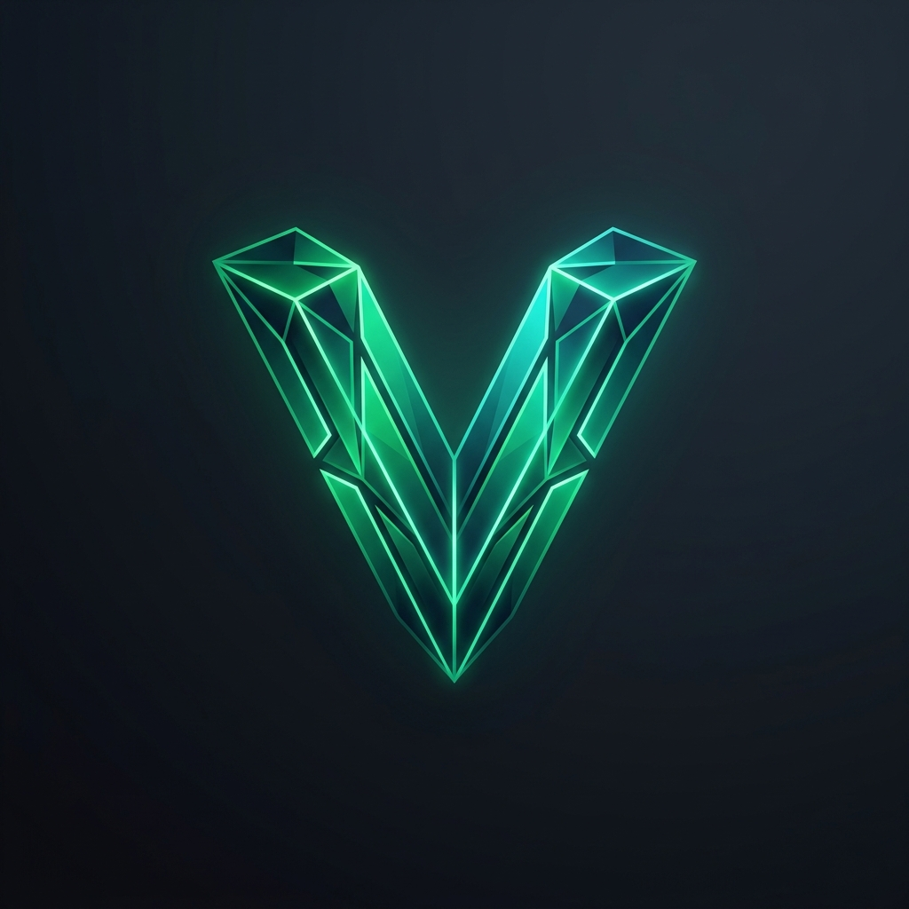

<div align="center">
  

  <h1>Vector AI</h1>
  <p><strong>The AI Business Command Center</strong></p>
  
  <p>
    <a href="https://vector-ai.vercel.app"></a>
    
    
    
  </p>
</div>

---

**Vector** is a multi-agent SaaS platform designed to orchestrate a team of executive AI agents. Whether you need startup ideation, technical architecture planning, financial modeling, or go-to-market strategies, Vector puts a full AI C-suite at your fingertips.

Built with a lightning-fast **Next.js 16** frontend and a robust **FastAPI** backend powered by the **Google Agent Development Kit (ADK)** and **Gemini 2.5 Flash**.

## ✨ Features

- **Multi-Agent Executive Council**: Collaborate with specialized AI roles:
  - 🧠 **Prism (Lead Architect)**: Master orchestrator that delegates tasks and merges outputs.
  - 💼 **Atlas (CEO)**: Business strategy and growth planner.
  - 💻 **Nexus (CTO)**: Technical architecture and feasibility analysis.
  - 📢 **Vanguard (Marketing)**: Brand positioning and launch strategy.
  - 📈 **Ledger (Finance)**: Financial intelligence and monetization strategy.
- **Lightning Fast UI**: Glassmorphism dashboard with real-time UI updates, dynamic agent status cards, and buttery-smooth Framer Motion animations.
- **Automated Document Engine**: Instantly generates production-ready markdown documents (Executive Summaries, Architecture Specs, GTM Plans) seamlessly bypassed for 100% reliable local demos.
- **Real-Time Telemetry**: Live terminal logging system tracking the granular thought processes of the AI agents.
- **Persistent Memory**: Connects to MongoDB Atlas for persistent project records across sessions.

## 🛠 Tech Stack

**Frontend (`/vector-app`)**
- **Framework**: Next.js 16 (App Router, Turbopack)
- **Styling**: Tailwind CSS, Framer Motion, Glassmorphism UI
- **Components**: Lucide React, React Markdown, remark-gfm
- **Deployment**: Vercel Ready

**Backend (`/mcp-server`)**
- **Framework**: FastAPI (Python 3.10+)
- **AI Engine**: Google Agent Development Kit (ADK), Gemini 2.5 Flash
- **Database**: MongoDB Atlas (motor asyncio)

---

## 🚀 Quick Start (Local Setup)

### Prerequisites
- Node.js 18+
- Python 3.10+
- MongoDB Atlas Cluster
- Google Gemini API Key

### 1. Setup Backend Engine
Navigate to the server directory and configure environment variables:
```bash
cd mcp-server
cp .env.example .env
```
Add your credentials to `.env`:
```env
MONGODB_URI="mongodb+srv://<USERNAME>:<PASSWORD>@<CLUSTER>.mongodb.net/vector_db?retryWrites=true&w=majority"
GEMINI_API_KEY="<YOUR_GEMINI_API_KEY>"
```

Install dependencies and start the API:
```bash
python -m venv .venv
source .venv/bin/activate
pip install -r requirements.txt
python -m uvicorn app.fast_api_app:app --host 0.0.0.0 --port 8000 --reload
```

### 2. Setup Frontend Dashboard
Open a new terminal and prepare the Next.js app:
```bash
cd vector-app
```
Create a `.env.local` file:
```env
MONGODB_URI="mongodb+srv://<USERNAME>:<PASSWORD>@<CLUSTER>.mongodb.net/vector_db?retryWrites=true&w=majority"
MCP_SERVER_URL="http://127.0.0.1:8000"
```

Install packages and run the development server:
```bash
npm install
npm run dev
```

Visit `http://localhost:3000` and enter the Board Room!

---

## ☁️ Deploying to Vercel

The frontend is fully optimized for Vercel deployment.

1. Push your code to a GitHub repository.
2. Go to your Vercel Dashboard and click **Add New... > Project**.
3. Import your GitHub repository.
4. Set the **Framework Preset** to Next.js.
5. Set the **Root Directory** to `vector-app`.
6. Add the Environment Variables (`MONGODB_URI` and `MCP_SERVER_URL`).
7. Click **Deploy**!

*(Note: The backend FastAPI service should be hosted separately on Render, Heroku, or Google Cloud Run, and its public URL provided as the `MCP_SERVER_URL`).*

## 📄 License

This project is licensed under the MIT License - see the LICENSE file for details.

